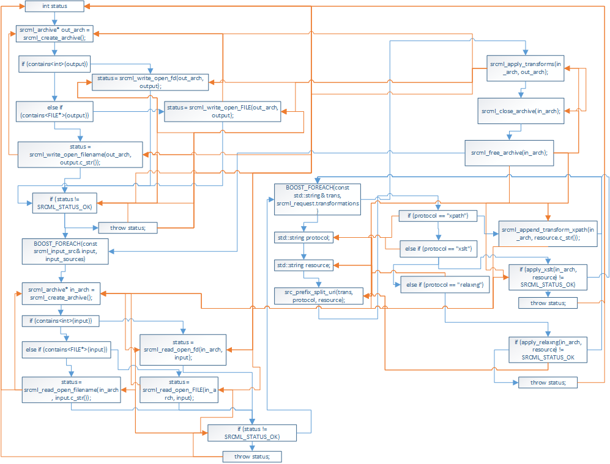
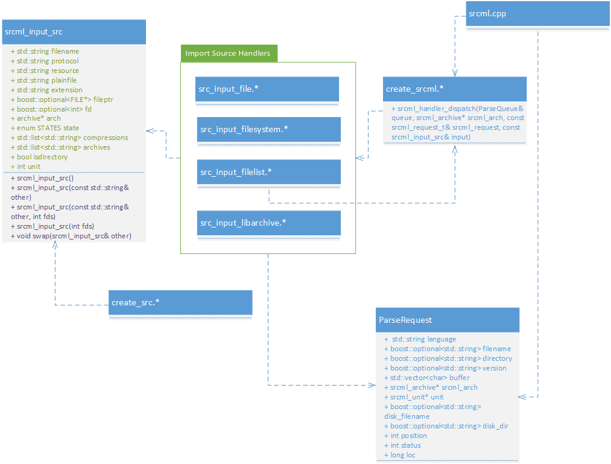
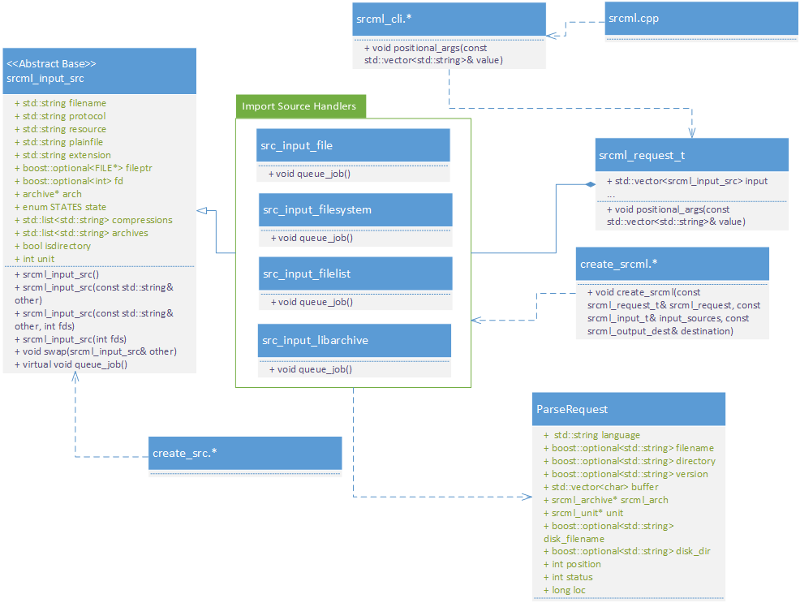

## SEM
### Add Additional XPath Functionality to Client
#### Narrative
In the old client, performing an XPath query results in a srcML archive containing the results of the query. While this can be convenient to view just the chucks of code that match the query, for the purposes of stacking multiple XPath queries or displaying query results in the context of the document body, it would be beneficial if users had access to functionality in the cli that allowed for XPath queries to be marked up in the context of the entire docuemnt. 

To support this functionality the new client should provide options that allow the user to provide either additional element or attribute markup to denote an Xpath query result. Example 1 illustrates the search result markup with an element and Example 2 shows the use of an attribute.  

**Example 1:**: Element to identify xpath search result. Element contains the namespace of "test" and element name of "search". CLI command options follow.

```
<test:search><while>while<condition>( <expr><name>a</name> <operator>&lt;</operator> <literal type="number">20</literal></expr> )</condition>
   <block>{
       <expr_stmt><expr><name>a</name><operator>++</operator></expr>;</expr_stmt>
   }</block></while></test:search>
```
**Element CLI Command:**
```
srcml [srcML input file] —xpath=//src:name —xmlns:test=http://test.com/test —element=test:search
```

**Example 2:**: Attribute to identify xpath search result. Attribute contains the namespace of "test", attribute name of "search", and a value of "Attr". CLI command options follow.

```
<while test:search="Attr">while<condition>( <expr><name>a</name> <operator>&lt;</operator> <literal type="number">20</literal></expr> )</condition>
   <block>{
          <expr_stmt><expr><name>a</name><operator>++</operator></expr>;</expr_stmt>
   }</block></while>
```
**Attribute CLI Command:**
```
srcml [srcML input file] —xpath=//src:name —xmlns:test=http://test.com/test —attribute test:search="Attr"
```

One specific applicaiton of this feature would be in assisting the srcMX GUI client for srcML to provide a visualization of the XPath queries within the scope of an entire file instead of simply showing the results on their own.

Figure 1 - PDG of the current state of the transform_srcml function in transform_srcml.cpp

Figure 1 above shows a PDG of the function in need of modification. If we examine the inner boost for each loop we can see the flow involved in selecting the an xpath transformation. When an Xpath transformation is identified, the diagram shows that the exection loops back to the top of the for each loop after calling the appropriate function which unlike the two transformations is a direct library call. Only a straightforward comparison of the tranformation type is performed before the function is called. In terms of data dependencies, most of them (status not included) are contained to the inner and outer boost for each loops. With this knowledge in mind, the proposed change would substitute the direct library call with an additional function call that would select the right xpath library function call give certain use defined fields in the srcml_request object. This wrapper approach will have the least amount of impact and with the exception of a few additional parameters (already available from the paramters of the trasform_srcml function itelf) the new change would almost be a drop in replacement for the old code.  

#### Change Plan
* API support provided by libsrcml is assumed
	* Coordination with maintainer of libsrcml for feature support is step one.
* Add fields to srcml_cli.hpp to store necessary input data for functionality
* Add cli options and functionality to collect the data from CLI input
* Extract Method Refactoring on transform_srcml.cpp for true result branch of xpath conditional 
* Add element logic to extracted method
* Add attribute logic to extracted method

----------------------------------------
### Object Oriented Input Sources
#### Narrative
In it's present state, the new srcml client's design is purely functional in most respects. One specific area of functionality that could benefit from the use of an object oriented design would be the input source handling. With a more object oriented approach, an inheritance hierarchy combined with one or more polymorphic methods could be utilized to simplify the way in which the input sources are deterimined and replace much of the contitional logic in create_srcml.cpp and consolidate those input checks and object creation in srcml_cli. The result of this change would make collecting data from an input source in create_srcml.cpp a single method call and make adding additional input sources more straight forward as developers would only need to inherit from an abstract base class and fill in the necessary functionality.

Figure 2 - UML class diagram of the current approach for handling various input sources

The UML class diagram in Figure 2 shows that at present, very few objects are involved in the process of handling input sources as any class with a ".*" at the end represents a file with a collection of free functions versus an object with methods attached to it. The core significant dependency is that each of the input source handlers in the current approach are all dependant the srcml_input_src object mostly for it's constructors and free functions. Since these free functions are applied to each sudo input source "class", it makes sense to couple these related modules together with an inheriance hierarchy and unify the way the objects are used. The could be accomplished by transforming srcml_input_src into an abstract base class with a virtual function to be implemented uniquely by each that the other handlers for their respective input. In addition to this change,  the input handler object creation could be moved to take place in srcml_cli while the prefixes (which ultimately determine the input handler anyway) are added to the inputs. This way the objects are already setup and ready to be passed off to create srcml for processing where the vector of srcml_input_src objects can be iterated and their functions to generate a parse request can be run in a straight forward loop. Figure 3 illustrates the potential design changes to the input handling sub system.
Figure 3 - Resulting UML class diagram after proposed changes


#### Change Plan
* Convert srcml_input_src. * to an Abstract Base Class
* Include public virtual function to generate a parse request to be implemented by all classes that implment the abstract class
* Starting with src_input_file.*, convert to subclass of "srcml_input_src"
* Substitute object creation in "create_srcml" and usage in place of function call to ensure behavior is preserved
* Add field to srcml_request_t for a vector of srcml_input_src objects
* Move object creation into srcml_cli.* as inputs are prefixed in the positional_args function
* Run the parse request generation function for each object in the vector when passed to create_srcml.*

----------------------------------------
### Add Git Input Source to Client
#### Narrative
The srcml client currently support a number of input sources from both local and remote files including HTTP(S), FTP(S), SSH, etc. While the remote protocol support is quite comprehensive, one noticible omission is native support for a source repository using git version control. This feature addition could allow users to enter a git repository url and even a revision sha as input to retrieve the source of a project as input to srcml. This would prevent a user from having to first clone a repository externally to their local machine before running srcml and would reduce the number of steps required in this circumstance to one. This feature can also prove useful for a webservice based version of the srcml client in which access to the source code on a physical device (such as tablet or phone) might not be feasible. Example1 shows the the CLi option interface extension.

**Example**: Prefix of "git://" to identify a git resource and --revision to aquire a specific version of the sourcr repository.

```
srcml git://[local or remourl for repo] --revision=[SHA]
```

Figure 2 shows a UML class diagram representation of  current state of the srcml input source module.  Figure 4 shows the new UML diagram after the proposed feature implementation. Only a few additional files namely a handler for a Git input source and any libGit2 related library files need to be added or imported into the system. In terms of modification to the existing design the srcml_request_t class will need an additional field to hold the revision SHA, and srcml_cli will require an additional option to support the collection of that additional data. Once the actual implementation of the collection of the input source is complete, adding a "git" check to create_srcml.cpp and calling the newly created function should complete the task.

```
INSERT FIGURE 4 HERE
```

#### Change Plan
* Add new field "revision" of type boost optional string to srcml_request_t
* Add new cli option --revision
* Add new files src_input_git.cpp and src_input_git.hpp
* Update CMake to build with libgit2 (static) or load library dynamically
* Create function src_input_git (ParseQueue& queue,
                    srcml_archive* srcml_arch,
                    const srcml_request_t& srcml_request,
                    const std::string& input_file)
   in src_input_git.* files.
* Use libgit2 for repository aquisition
* Take aquired data for each retrieved file and create and queue a ParseRequest
* Import src_input_git.hpp in create_srcml.cpp
* Add conditional to srcml_handler_dispatch function in create_srcml.cpp for "git"
* Add  function src_input_git (ParseQueue& queue,
                    srcml_archive* srcml_arch,
                    const srcml_request_t& srcml_request,
                    const std::string& input_file)
  to the conditional.
  
